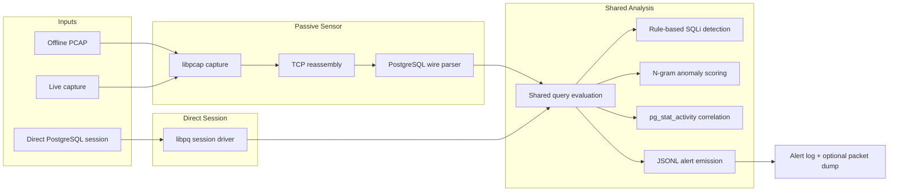

# Architecture

`pgsql_ids` has two entry paths that share the same detection core:

- passive packet inspection from a PCAP file or live interface, and
- direct PostgreSQL session mode for executing and scoring SQL statements.

## Flow

## Modules

| Module | Responsibility |
|--------|----------------|
| `src/capture.c` | Open live or offline packet sources and apply BPF filtering. |
| `src/reassembly.c` | Rebuild ordered TCP streams from fragmented packets. |
| `src/pg_parser.c` | Extract PostgreSQL SQL text from frontend messages. |
| `src/detector.c` | Run keyword and regex SQLi rules. |
| `src/ngram.c` | Train, load, and score the n-gram anomaly model. |
| `src/query_eval.c` | Merge detector, n-gram scoring, and alert emission. |
| `src/pg_correlate.c` | Enrich passive alerts with `pg_stat_activity`. |
| `src/db_session.c` | Drive direct database sessions over libpq. |
| `src/alert.c` | Write JSONL alerts and optional flagged-flow PCAP dumps. |
| `src/main.c` | CLI orchestration and mode selection. |

## Data Flow Notes

- Passive mode processes packet payloads, then feeds them through reassembly, parsing, and shared evaluation.
- Direct session mode bypasses network capture and sends each SQL statement straight to the shared evaluation path.
- `-c` is only for passive correlation; `-d` is the direct database session path.